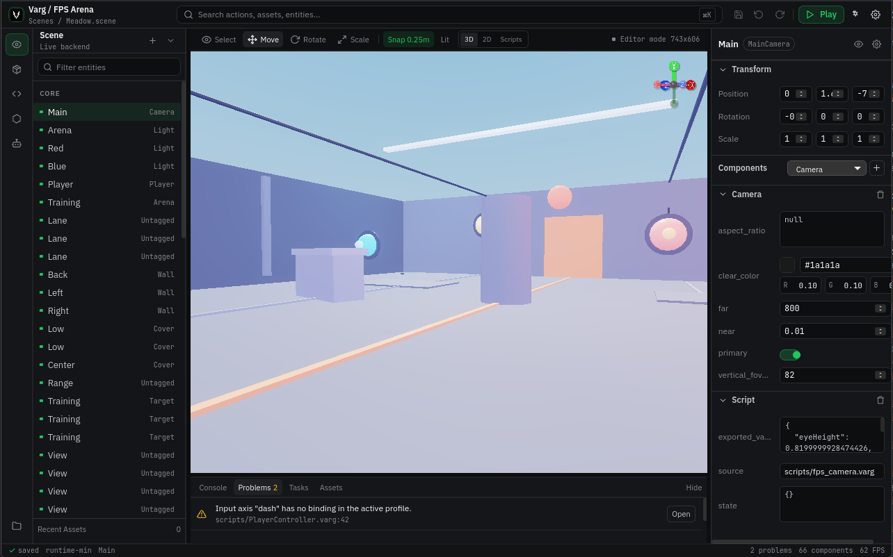

# Varg

[](https://github.com/viloris-org/Varg/actions/workflows/core.yml)
[](https://github.com/viloris-org/Varg/actions/workflows/nightly.yml)
[](LICENSE)


[English](README.md) | 简体中文 | [日本語](README.ja.md)

Varg 是一个 AI 原生的游戏引擎。用自然语言描述你想做的游戏，多个自治 Agent 会帮你构建——场景、逻辑、UI，全部搞定。完整的可视化编辑器也在那儿，随时供你微调、打磨、完全掌控。



> **截图占位**——等 UI 稳定后请替换为实际编辑器截图。

## 快速上手

```sh
git clone https://github.com/viloris-org/Varg
cd Varg

# 启动编辑器
cd editor
bun install
bun run dev:tauri
```

> **前提条件：** [Rust ≥ 1.78](https://rustup.rs/)、[Bun ≥ 1.0](https://bun.sh/)、
> [Tauri 系统依赖](https://v2.tauri.app/start/prerequisites/)。
> Linux 用户：`sudo apt install libwebkit2gtk-4.1-dev build-essential libssl-dev
> libayatana-appindicator3-dev librsvg2-dev`

## 功能特性

- **AI 原生内核**——不是外挂的 AI 助手，而是多 Agent 集群自主规划、构建、审查你的游戏。自然语言输入，可游玩场景输出。沙箱审查保障项目安全。
- **声明式游戏描述**——六套完整声明式系统（行为树、场景图、UI 布局、系统配置、资源清单、项目结构），让 Agent 生成结构化 JSON 而非代码。LLM 生成成功率从 ~50% 跃升至 ~90%。
- **可视化场景编辑器**——通过直观界面放置对象、调整变换、添加组件。两全其美：让 AI 完成繁重工作，再手工打磨每个细节。
- **实时播放模式**——点击 Play，物理和脚本开始运行；点击 Stop，零清理。编辑场景从不被修改。
- **资源管线**——将 glTF/PNG 拖入项目面板。文件监听自动触发导入，热重载实时推送更新。
- **可插拔渲染**——无需修改引擎代码即可切换后端。自带 WGPU。
- **无头运行时**——同一引擎用于服务器、CI 管线或自动化构建。无需窗口。
- **零不安全代码**——每个 crate 使用 `#![forbid(unsafe_code)]`。默认安全。

## 项目结构

```
Varg/
├── editor/                  # Tauri 桌面应用（React + Rust）
├── crates/
│   ├── engine-editor/       # 编辑器工作流、服务、Agent 工具
│   ├── engine-ecs/          # 场景、实体、变换、世界
│   ├── engine-assets/       # 数据库、导入器、热重载
│   ├── engine-render/       # 渲染图、设备 trait
│   ├── engine-render-wgpu/  # WGPU 后端
│   ├── engine-physics/      # 物理（rapier3d）
│   ├── engine-audio/        # 音频管线
│   ├── engine-core/         # ID、错误、数学、配置
│   ├── engine-platform/     # 窗口、输入、文件系统
│   ├── engine-script-rhai/  # Rhai 脚本
│   ├── engine-animation/    # 动画系统
│   ├── engine-ai/           # AI 规划器与系统提示
│   ├── engine-agent-cluster/# Agent 编排
│   ├── runtime-min/         # 组合根
│   └── …                    # i18n、shader、policy、skeleton 等
├── xtask/                   # 构建与自动化任务
├── examples/                # 示例项目与场景
└── docs/                    # 设计笔记
```

## 编辑场景

1. 启动编辑器 → **Hub** 画面
2. 创建或打开一个项目
3. **Hierarchy** 面板列出场景中的所有对象
4. **Inspector** 显示选中对象的变换和组件
5. **Scene View** 渲染 3D 视口——旋转、平移、缩放
6. 点击 **Play** 在 **Game View** 中运行物理和脚本
7. 添加组件（Camera、Light、MeshRenderer、Rigidbody、Collider……）或编写 Rhai 脚本

## 构建 Profile

Profile 在编译时选择链接哪些子系统：

| Profile | 包含内容 |
|---|---|
| `editor` | 为 Tauri 前端提供编辑器服务、wgpu 视口和 Agent 工具 |
| `runtime-min` | 无头模式——CI 测试、服务器、自动化构建 |
| `runtime-game` | 无头 + 窗口支持 |
| `dev-full` | 全部：编辑器、物理、音频、脚本、Agent、渲染 |

```sh
cargo build -p runtime-min --no-default-features --features editor
cargo build -p runtime-min --no-default-features --features runtime-min
```

## 构建编辑器

```sh
cd editor
bun install

# 开发模式（前端 + Rust 后端热重载）
bun run dev:tauri

# 分发包
bun run tauri build
# → editor/src-tauri/target/release/bundle/
```

## 测试

```sh
# 完整引擎测试套件
cargo test --workspace

# 仅无头运行时（快速）
cargo test -p runtime-min --no-default-features --features runtime-min

# 编辑器服务
cargo test -p engine-editor --no-default-features --features agent-tools

# WGPU 后端
cargo test -p engine-render-wgpu
```

## 许可证

Mozilla Public License 2.0。详见 [LICENSE](LICENSE)。
